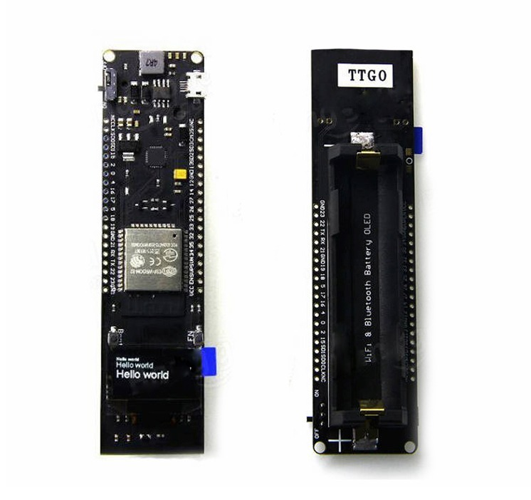
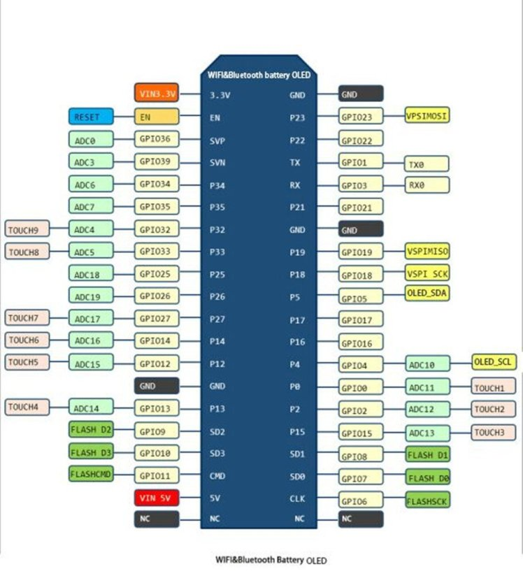
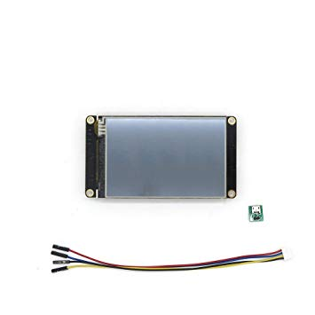
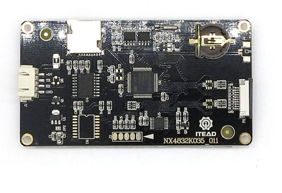

Playground for

## TTGO WiFi & Bluetooth Battery ESP32 0.96 inch OLED development tool  
## and Nextion Enhanced NX4832K035 - Generic 3.5'' HMI Touch Display

#### TTGO Features:

* When you do some ESP32 projects you must hate to add a power bank to provide the power   
* This tiny board could solve such problems  
* A LG 3000mAH 18650 battery could make ESP32 run 17 hours or more  
* 18650 charging system integrated.  
* Indicate LED inside (Green means full & Red means charging)  
* Charging and working could be at the same time.  
* 1 Switch could control the power  
* 1 extra LED could be programmed(Connected with GPIO16[D0])  
* 0.5A charging current   
* 1A output   
* Over charge protection   
* Over discharge protection   
* Full ESP32 pins break out 

#### Nextion Features:

* Nextion Enhanced NX4832K035 is a 3.5'' HMI TFT display,  
* with 32MB Flash data storage space,  
* 1024 byte EEPROM,  
* 8192 byte RAM,  
* GPIO support, to control external devices.  

#### Connecting TTGO ESP32 and Nextion:

* TTGO 5V <--> Nextion 5V
* TTGO GND <--> Nextion GND
* TTGO 21 <--> Nextion TX
* TTGO 22 <--> Nextion RX

